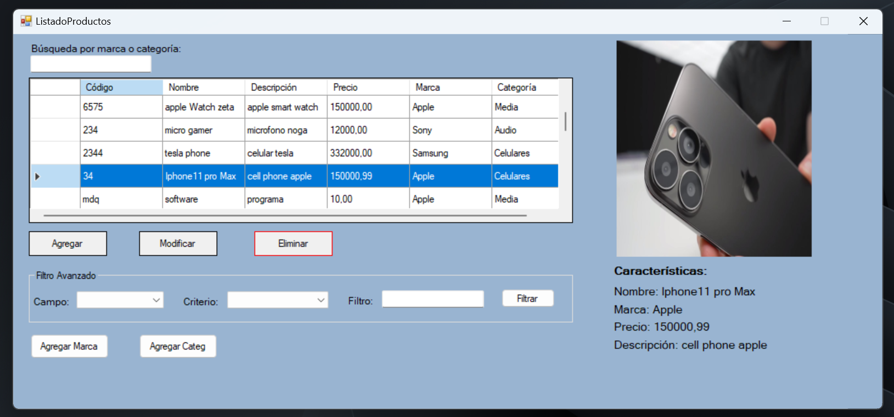
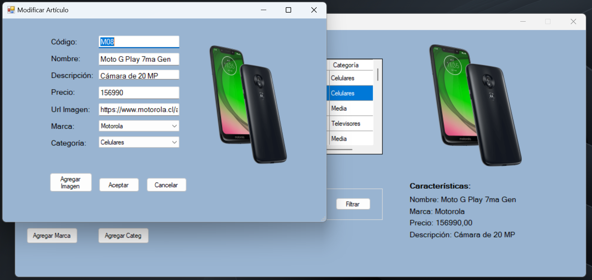

## Trabajo Práctico Final - Curso C# Nivel 2
Se trata de un sistema de gestión de inventario en formato de aplicación de escritorio.

Los usuarios pueden realizar las tareas básicas de un CRUD (leer, modificar, crear y eliminar registros).

Posee filtros para una búsqueda rápida de artículos.

Permite la carga de imágenes tanto desde la web como de una carpeta local.

Posee manejo de excepciones y validaciones para evitar errores y artículos duplicados.

Arquitectura en capas.

### Tecnologías utilizadas:
- C#
- .NET Framework
- SQL Server
- Windows Forms
- ADO.NET

